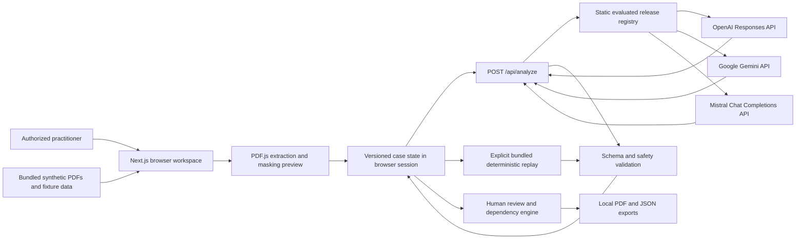

# Architecture

## 1. Status and authority

This document freezes the P0 technical architecture for ContextFirst Nexus. It is an implementation contract, not proof that the system has been built or validated.

The controlling order is:

1. `docs/SAFETY_AND_DATA.md` for safety and data rules.
2. `PROJECT_BRIEF.md` for product direction and scope.
3. `docs/PRODUCT_SPEC.md` for user-facing behavior.
4. `docs/CONTRACTS.md` for shared data and API contracts.
5. This document for module and runtime decisions.
6. `docs/MODEL_ROUTING.md` for the more specific provider selection, release eligibility, recovery, and provider-disclosure rules within this architecture.

### 1.1 Approved routing migration

DEC-045 supersedes browser-controlled provider selection and switching. TASK-039 simplifies the replay-only public Purpose flow and automatically binds exactly one selectable local replay release. TASK-040 must first reconcile the contracts and this architecture before implementing any future server-managed live routing.

The future live order is OpenAI, Gemini, Mistral, then a separately evaluated and statically admitted fourth provider. Groq `openai/gpt-oss-120b` is only an evaluation candidate. Replay remains a separate local execution path, never a live fallback. The `ENABLE_LIVE_ANALYSIS` server gate, static admission, credentials, spend approval, and separate production approval remain mandatory.

Any implementation task that needs to change a frozen choice must stop, record the proposed change in `decision-log.md`, and obtain coordinator approval before dependent work continues.

## 2. Architecture goals

The P0 architecture must:

- deliver the complete judged flow with the bundled synthetic packet;
- make source grounding, human review, and safe failure observable in the interface;
- keep raw source files out of the model request and application logs;
- remain small enough to build, understand, test, and deploy during a hackathon;
- allow independent worktree tasks without competing architectural patterns;
- avoid claims of production security, real-case readiness, or legal validation.

## 3. P0 topology

ContextFirst Nexus is one Next.js 16 App Router application deployed to Vercel. It is not a microservice system.



There is no P0 database, background worker, vector database, durable server case store, cross-case index, email service, analytics SDK, or external action tool.

## 4. Frozen technical choices

| Area | P0 decision | Reason |
|---|---|---|
| Application | Next.js 16 App Router, React 19, TypeScript, Tailwind CSS 4 | Matches the deployed repository and supports pages plus a server-only model route |
| Deployment | Existing Vercel project | Keeps one permanent URL and Git-connected deployment |
| Server boundary | One Node.js route handler file at `/api/analyze`, with a safe capability `GET` and live-analysis `POST` | Keeps keys server-side while exposing only a non-secret evaluated-release projection |
| Case persistence | React context with `useReducer`, plus versioned `sessionStorage` for serializable derived state | Supports route changes and refresh recovery without a database |
| PDF reading | `pdfjs-dist@6.1.200` in a browser worker | Extracts text, pages, and text positions without sending raw PDFs to the server |
| P0 input | The bundled synthetic, text-based PDF packet only | Gives reliable coverage and protects against accidental real-case processing |
| OCR | Not supported in P0 | Image-only or unreadable pages must be labelled unavailable instead of silently guessed |
| Validation | `zod@4.4.3` schemas plus deterministic semantic checks | Schema validity alone cannot establish citation or review validity |
| Live AI providers | OpenAI Responses API, Google Gemini API, and Mistral Chat Completions API behind server-only provider adapters | Keeps provider-specific behavior inside one narrow, testable boundary |
| Quality baseline | Evaluated release configuration for `gpt-5.6-sol`, reasoning effort `medium` | Accuracy-first baseline for the synthetic evaluation set |
| Secondary live provider | Evaluated release configuration for `gemini-3.5-flash` | Adds a cost-conscious recovery option behind the same gates |
| Third live provider candidate | Unpaid `mistral-small-free-v1` for `mistral-small-2603`, reasoning effort `medium` | Adds a direct free-tier recovery option that remains unselectable until evaluation passes |
| Provider routing | Static server-side release registry, version-controlled admission record, and explicit manual selection and recovery | Prevents arbitrary models, environment-based promotion, and silent cross-provider transmission |
| Replay | Version-matched bundled deterministic replay outside live-provider routing | Keeps the judged flow available while clearly distinguishing replay from live AI |
| PDF export | `@react-pdf/renderer@4.5.1`, loaded only on the export route | Produces a structured local PDF without a separate rendering service |
| JSON export | Native browser `Blob` download | Preserves the exact versioned handoff contract |
| UI primitives | A small, inspected subset of shadcn/ui patterns plus `lucide-react@1.24.0` | Accessible foundations with local, editable component code |
| Unit tests | `vitest@4.1.10`, Testing Library, `jest-dom`, and `jsdom` | Fast deterministic and component checks |
| End-to-end tests | `@playwright/test@1.61.1` with `@axe-core/playwright@4.12.1` | Covers the full flow, keyboard behavior, and automated accessibility checks |

A single dependency-bootstrap task installs and configures all approved packages before parallel feature work begins. It exclusively owns `package.json`, `package-lock.json`, `components.json`, shared test configuration, and the PDF.js asset-copy script during bootstrap. Feature worktrees must not install packages or edit those shared files concurrently.

The reducer stores run output in one canonical `CaseCandidate[]` collection. `TimelineEvent`, `NexusRow`, and `ContextGap` are discriminated `CaseCandidate` branches, and timeline, Nexus, context-gap, lane, queue, and blocker views are read-only selectors over that collection. No route, feature, persistence projection, or export may maintain a parallel mutable candidate array.

The third live provider uses a native `MistralAnalysisAdapter` backed by `@mistralai/mistralai`. The dependency-bootstrap task will pin the installed SDK version later and record it before the adapter is implemented. Mistral is not routed through an OpenAI-compatible abstraction.

The remaining bootstrap versions are `shadcn@4.13.0`, `server-only@0.0.1`, `@testing-library/react@16.3.2`, `@testing-library/jest-dom@6.9.1`, `@testing-library/user-event@14.6.1`, `jsdom@29.1.1`, `eslint@10.7.0`, and `eslint-config-next@16.2.10`. The lockfile records transitive packages added by the selected shadcn components.

The supported Node range is `>=22.13.0 <27`; the Vercel deployment target is Node 24. The current local Node 26 environment remains within the supported range.

## 5. Deliberately excluded P0 technology

The following are not part of P0:

- LangChain, LlamaIndex, agent frameworks, autonomous agents, or tool-calling loops;
- Vercel AI SDK, because one direct structured request is simpler for this prototype;
- embeddings, semantic vector search, hosted file search, or a vector database;
- model web access, browsing, email, filing, or referral tools;
- Supabase, Firebase, Postgres, SQLite, Redis, or other durable case storage;
- Prompt Guard 2 or another prompt-injection classifier as a blocking control;
- local model training, fine-tuning, or large local inference;
- additional live providers such as Cerebras before a separately approved need and evaluation;
- OCR providers, scanned-document claims, audio, video, or image forensics;
- React Flow, chart libraries, or large graph-visualization packages;
- production authentication or a simulated login described as authentication.

Prompt Guard 2 may be evaluated later as an advisory signal. It must not hide or delete evidence and must demonstrate benefit on the project's fixtures before adoption.

## 6. Routes and screen ownership

| Route | Capability | Rendering |
|---|---|---|
| `/` | Product boundary, intended user, non-use rules, synthetic demo entry | Server page with small interactive entry control |
| `/case/demo/purpose` | Case chooser, Case Purpose Brief, plain-language analysis start, and consolidated disclosure | Client form inside case workspace layout |
| `/case/demo/intake` | Document list, extraction, masking preview, coverage, explicit analysis launch, and processing | Client-heavy route; shared PDF source module loaded here |
| `/case/demo/review` | Timeline, Charge-Coercion Nexus, review lanes, review queue, source drawer, and audit | Client workspace; shared PDF source module loaded only when a citation opens |
| `/case/demo/export` | Export gate, safe-share selection, preview, PDF, and JSON download | Client route; PDF renderer loaded here only |
| `/trust` | System card, data flow, limitations, audit explanation, and Safety Lab | Server shell with deterministic fixture results |
| `/api/analyze` | Return a safe evaluated-release projection on `GET`; validate the approved request, call the explicitly selected provider, validate the response, and return candidates on `POST` | Node.js route handler |

The `/case/demo/*` layout owns the case-state provider, left navigation, case boundary label, progress status, and Reset Case action. A user can complete the judged flow without a hidden route or developer control.

## 7. Proposed repository modules

The application keeps the existing root `app` directory. It must not be moved to `src` during P0.

```text
app/
  api/analyze/route.ts
  case/demo/layout.tsx
  case/demo/purpose/page.tsx
  case/demo/intake/page.tsx
  case/demo/review/page.tsx
  case/demo/export/page.tsx
  trust/page.tsx
components/
  shell/
  ui/
features/
  purpose/
  documents/
  analysis/
  review/
  export/
  trust/
lib/
  ai/server/
  analysis/
  citations/
  contracts/
  export/
  fixtures/
  guidance/
  redaction/
  security/
  state/
prompts/
  case-analysis.v1.ts
fixtures/
  cases/
  evals/
  guidance/
public/
  fixtures/cfn-demo-001/
tests/
  e2e/
  fixtures/
  unit/
```

Rules:

- `app` composes routes and server boundaries. Domain rules do not live in page files.
- `features` owns user-facing feature components and feature-specific orchestration.
- `lib` owns pure domain logic, contracts, validation, and provider adapters.
- `lib/ai/server` and `prompts` are server-only. Provider adapters, prompts, and canonical input construction may be imported only by the analysis route and one private evaluation entry point. The release registry and reviewed static admission record remain runtime-only for the analysis route. The private entry point is callable only by the local approved evaluation runner, has no HTTP route or browser import, reuses the exact adapters, prompt, fixture binding, redaction, and post-validation path, and writes evidence only. It bypasses runtime selectability solely to measure a frozen release before admission; it cannot alter registry state, public availability, or admission. The analysis route `GET` handler returns the safe capability projection without any key, endpoint, private configuration, or account evidence content.
- `fixtures` owns structured synthetic source truth and expected evaluation behavior.
- `public/fixtures` contains only visibly synthetic PDF assets.
- shared contracts are imported from `lib/contracts`; workers must not create competing local types.

## 8. End-to-end data flow

### 8.1 Purpose and authorization

1. The user selects the bundled synthetic case.
2. The user completes the Case Purpose Brief and authorization attestation.
3. The user explicitly selects one available evaluated live-provider release or the separately labelled bundled deterministic replay.
4. A live selection requires acknowledgement of its current provider-specific data-flow disclosure.
5. The unpaid Gemini and Mistral configurations remain available only for the bundled synthetic fixture, and Mistral remains unselectable until its exact release has matching passed reviewed static admission and coordinator-recorded deployed-account availability.
6. Deterministic validation blocks intake until all required fields and applicable provider acknowledgements are valid.
7. The saved brief receives a stable ID and an audit event.

### 8.2 Document extraction and coverage

1. The browser loads each bundled PDF from `public/fixtures/cfn-demo-001`.
2. PDF.js extracts text by page in a same-origin web worker and records available text positions.
3. A canonical fixture manifest maps extracted text into stable page and segment IDs and verifies expected page counts.
4. Missing page D04 page 3 is represented internally as `missing` and labelled Unavailable, missing page in the interface, not as empty successful content.
5. An image-only, malformed, or unmatched page receives a failed-stage record and cannot support a candidate.

The original PDF remains unchanged. Raw PDF bytes are never included in the model request.

A browser-computed source hash may support fixture-integrity checks. It must not be described as chain of custody, evidentiary authenticity, or tamper-proof storage.

Stable citation resolution does not depend on PDF.js text-item grouping alone. The canonical manifest freezes document ID, page number, segment ID, original character range, and expected normalized text. Resolution first attempts exact codepoint matching. Multiple bounded exact-codepoint occurrences inside the same known, available, allowlisted, candidate-eligible segment create the only manually reviewable ambiguity. The sole fallback applies Unicode NFC, normalizes line endings, collapses whitespace, preserves case and punctuation, and succeeds only for one unique normalized lookup. Zero matches and multiple normalized-only matches are quarantined rather than offered for manual resolution.

### 8.3 Masking

1. Deterministic detectors identify only the declared fixture classes: email, phone, passport, bank account, address, date of birth, and practitioner-supplied sensitive names.
2. Suggested masks show class, source location, and replacement token.
3. The user previews, edits, and approves the mask set.
4. A deterministic redaction map preserves the relationship between original and redacted character ranges.
5. A deterministic leak scan runs on the provider payload and safe-share export.
6. A failed leak scan blocks the provider call or export.

The interface calls this suggested masking or redaction. It never calls it guaranteed anonymization.

### 8.4 Model analysis

The field list below documents the integrated pre-TASK-040 live request and remains available only as a migration baseline while public live analysis is disabled. TASK-040 must replace its browser-selected release fields with a versioned provider-neutral intent before managed routing is implemented. TASK-039 uses only the separate local replay command.

The browser sends only:

- request schema, case, fixture, and canonical fixture digest;
- purpose brief ID and only the allowed role, fictional jurisdiction, source-language, and requested-handoff enums;
- literal approved mask-review and passed leak-scan states;
- legacy literal live mode and one provider/release selection, to be removed by TASK-040 contract reconciliation;
- complete correlated provider-disclosure acknowledgement: provider, release configuration, service tier, disclosure version, three required true attestations, safe acknowledgement ID, and timestamp;
- selected canonical segment IDs;
- reviewed mask IDs, segment IDs, ranges, classes, allowlisted replacement tokens, and review states.

Free-text purpose, authority, organization, recipient, and reviewer fields stay browser-local and are never included in the model request. The request also excludes raw PDF or source text, document and page metadata beyond what selected segment IDs imply, source type, translation, provenance, coverage objects, browser run IDs, and recovery linkage.

The server:

1. returns a safe disabled response unless server-side `ENABLE_LIVE_ANALYSIS` is exactly `true`;
2. rejects an invalid, oversized, unapproved, or unredacted request;
3. loads the canonical fixture segments server-side and applies the validated approved mask spans, so a caller cannot smuggle arbitrary text under a valid fixture ID;
4. verifies the canonical fixture digest, constructs the approved redacted derivative, computes its digest server-side, and re-runs the declared identifier scan;
5. validates the requested provider and release configuration against the static server-side evaluated registry;
6. verifies a current provider-specific acknowledgement and rejects an arbitrary provider, endpoint, model, or API key supplied by the browser;
7. wraps document content as untrusted JSON data separate from application instructions;
8. gives the selected model no tools, credentials, files, search, agents, conversations, browsing, memory, or external action capability;
9. requests the one common strict structured proposal shared by all three live-provider adapters with streaming disabled;
10. applies `store: false` for OpenAI, uses the frozen stateless request path for Gemini, and uses one stateless, non-streaming JSON Schema Chat Completions request with disabled SDK retries for Mistral;
11. rejects a timeout or invalid response without a prose fallback or silent call to another provider;
12. performs the same schema, ID, citation, leak, instruction-propagation, and prohibited-output validation after any live-provider adapter;
13. returns only one validated `CaseCandidate[]` collection plus a terminal live execution result and safe provider metadata, with no parallel timeline, Nexus, or context-gap arrays, browser case history, or recovery-link claim.

The browser analysis controller dispatches a validated local start command before making exactly one live request. Starting does not increment `caseRevision`, and other material mutations remain blocked while the request is pending. The stateless route returns a terminal execution result without recovery metadata. The browser reducer accepts it only for the matching pending command and unchanged source case revision, validates any recovery link against its preserved failed-run history, attaches locally derived recovery metadata, and atomically appends and activates the run. Preflight rejection creates no run and preserves the prior active run.

If the browser loses the network, receives no response, or cannot parse the response envelope, the controller dispatches `record_live_analysis_transport_failure` with a fixed safe reason. The reducer clears only the matching pending request, records that the remote outcome is unknown and no output was accepted, preserves the prior active run, and creates no run or recovery link. A later attempt is explicit and unlinked because there is no verified terminal execution. Deterministic replay follows the local lifecycle but never calls the route.

The route uses `runtime = "nodejs"`, `maxDuration = 60`, and `Cache-Control: no-store`. It enforces JSON content type, checks the expected same-origin browser path where practical, and rejects request bodies above 1 MB. Each live-provider adapter has a 45-second timeout and the browser abort timeout is 55 seconds. A false public UI flag can never enable a server-disabled route. When the public flag is true but the server flag is false, the UI presents Live analysis unavailable and offers the explicit replay option. These controls narrow misuse but do not constitute production authentication.

Provider data handling is not treated as interchangeable. OpenAI retention limitations must match the configured account and published API controls. Google's unpaid Gemini terms permit submitted content and generated responses to be used to improve Google products and to be processed by human reviewers. Mistral's current free-service documentation permits input and output to be used for training unless the account opts out, describes retention of API request data for up to 30 days for safety and abuse monitoring, and does not offer zero data retention on the free tier. Therefore, unpaid Gemini and Mistral are restricted to the exact bundled synthetic fixture and are prohibited for any future real, private, confidential, client, or survivor material. OpenAI `store: false`, the stateless Gemini request path, and a stateless Mistral request are not described as zero retention. The provider-specific disclosure and system card must state the actual configured service tier, training-use setting when known, retention limitation, and processing-region limitation.

### 8.5 Deterministic post-validation

Every model-proposed item passes all applicable checks before display:

- referenced segment and document IDs exist in the request;
- cited page belongs to the cited document;
- provider quote input resolves through exact codepoint matching or one unique conservative normalized lookup, while the stored and displayed citation quote is always the exact canonical source slice at the resolved range;
- the redacted quote range maps deterministically back to one browser-local source range;
- the evidence nature is not upgraded by the model;
- no prohibited conclusion or score field exists;
- each candidate has at least one valid dependency or is explicitly a gap;
- all enum values and identifiers match `docs/CONTRACTS.md`;
- embedded instructions do not propagate into findings or exports;
- segments marked `evidence_only`, including `D07-P2-S03`, can remain visible to the model for the containment test but cannot support a case candidate or export statement;
- support status is recalculated by code when a citation is invalid or coverage is unavailable.

Schema-valid output can still fail these checks. Failed items are quarantined with a safe reason code and never silently repaired by another model call.

### 8.6 Human review and dependency recalculation

The model proposes candidates. Deterministic code builds one `CaseCandidate[]` collection and the dependency graph. Timeline, Nexus, context-gap, lane, queue, and blocker projections are derived read-only selectors over those same canonical records, so one review or invalidation cannot drift across mirrored arrays. The practitioner reviews one consequential item at a time.

A reviewable citation with multiple bounded exact-codepoint occurrences in one eligible canonical segment remains blocked until the practitioner chooses one recomputed canonical redacted range through the central `resolve_citation` command. The segment cannot change. Multiple normalized-only matches and all cross-segment or unsafe ambiguity are quarantined with no candidate or citation. The reducer, not the component, derives the manually resolved citation, preserves the prior ambiguous state in decision and audit history, stales the gate, and recalculates affected support without auto-accepting review.

Accept, edit, reject, mark uncertain, and withdraw append new events within the current application session. They do not rewrite earlier events through normal application actions. This is an explanatory synthetic-demo history, not an immutable or forensic audit log. When a dependency changes, the engine traverses only downstream items, marks affected review decisions invalidated, revokes export readiness, and leaves unrelated decisions intact.

The golden transition for `CAND-TASK-0402` is defined in `docs/DEMO_AND_FIXTURES.md` and is a required contract test.

### 8.7 Export

The model cannot generate the final handoff. Deterministic code selects only review-eligible records, runs the export gate, builds the versioned `ExportManifest`, and renders PDF and JSON locally after a user action.

No P0 route emails, uploads, files, refers, or otherwise transmits an export.

The PDF and JSON are generated from the same manifest. P0 does not claim that the PDF is PDF/UA compliant or a tagged accessible document. The structured JSON is the machine-readable companion, and a real pilot must select and validate an accessible-document export approach.

## 9. Model strategy

### 9.1 Evaluated live configurations

P0 defines exactly three live-provider release configurations:

1. Provider ID `openai`, release `openai-quality-v1`, and model `gpt-5.6-sol` with reasoning effort `medium` as the quality baseline.
2. Provider ID `google_gemini`, release `gemini-quality-v1`, and model `gemini-3.5-flash` on the unpaid synthetic-only tier.
3. Provider ID `mistral`, release `mistral-small-free-v1`, and model `mistral-small-2603` on the unpaid synthetic-only tier with reasoning effort `medium`.

A static server-only registry binds each entry to its allowed model or replay artifact, adapter, inference configuration, disclosure version, service tier, prompt version, and schema version. Each of the three live entries also binds one version-controlled admission record. The local replay entry has no live-provider admission record and is governed by its exact deterministic replay and fixture versions. A private server-only evaluation entry may call the exact frozen adapter before runtime admission only after the approved local runner records the exact call count, cost estimate, and explicit spend approval. It accepts only the bundled synthetic fixture and frozen release configuration, is unreachable from HTTP and browser code, and produces versioned evidence without changing runtime state. A later narrow static handoff verifies that evidence and records live runtime admission state. No environment value, runtime report-file read, provider response, or evaluation execution can promote a release.

A live release is selectable only when it is configured, explicitly enabled, and its exact static admission record reflects a passed provider-contract and safety evaluation. `mistral-small-free-v1` also requires a coordinator-recorded available deployed-account release status and otherwise remains unselectable. Local replay is governed separately by its fixed trusted-bundle and version checks and reports evaluation as not applicable. The server never accepts a browser-supplied endpoint, API key, admission record, or arbitrary model name.

The exact provider, requested model, returned model identifier when available, release configuration, reasoning or thinking setting, adapter version, prompt version, schema version, service tier, disclosure version, run mode, token usage when returned, and timestamp are normalized into `AnalysisRun` provenance and shown in the system card. All API keys stay server-side.

An environment change cannot silently admit or promote a model. Changing any evaluated release requires a recorded decision, development-set evidence, renewed held-out assurance, and a reviewed static admission handoff. The system card must disclose moving aliases unless immutable snapshots are selected later.

### 9.2 Manual selection and recovery

The practitioner manually selects one available evaluated live configuration before analysis and acknowledges that provider's current data flow, or explicitly chooses the separately labelled bundled deterministic replay and acknowledges that it is frozen local output rather than live AI. Display and recovery order is OpenAI, Gemini, Mistral, then replay. This is presentation order, not an automatic attempt chain. OpenAI remains the quality baseline until a recorded evaluation establishes that another exact release satisfies the same gates and performs better for this task.

A failed live attempt remains visible through safe provenance. Future cross-provider recovery is server-managed, bounded to DEC-045's classified operational failures, and uses one canonical approved redacted input. A configuration or release rejection before a run starts returns `run: null` and records a safe audit event instead of inventing a run. Timeout or transport failure with unknown remote execution never advances to another provider. The router never merges outputs, never evades quota with multiple keys, and stops after one accepted result.

A provider refusal, invalid structured response, prohibited output, citation failure, injection propagation, privacy failure, semantic failure, partial or accepted output, or other safety-validation failure stops routing. Another model must not be used to shop around a refusal or repair unsafe output invisibly. Deterministic replay remains a separate, version-matched local path and is never represented as live AI or a live fallback result.

The project does not publish an overall accuracy percentage from its small synthetic set. Cost and latency are considered only after each compared provider configuration satisfies the same deterministic and model-backed safety gates.

### 9.3 Provider-neutral proposal contract

All three live adapters receive the same server-constructed canonical input and target one common, conservative structured proposal schema. Provider-specific request and response details remain inside `lib/ai/server`. The shared schema uses only the JSON Schema features supported by all three selected provider APIs.

Every adapter result is parsed into the same provider-neutral `ModelAnalysisProposal` before deterministic semantic validation. Neither adapter may create a final citation, support status, review decision, legal conclusion, audit event, dependency result, or export record. Provider output is untrusted even when it matches the schema.

### 9.4 Prompt structure

The prompt has four explicit parts:

1. fixed system boundary and prohibited conclusions;
2. requested analysis tasks and output schema;
3. versioned labels and definitions;
4. redacted documents serialized as untrusted data.

The task is extraction and relationship suggestion, not open-ended legal reasoning. International guidance cards are deterministic local content and are not injected as case proof.

## 10. Guidance architecture

P0 uses a small versioned local guidance pack. Each card contains a source-register ID, issuer, title, version, jurisdiction or scope, reviewed excerpt, locator, last-verified date, allowed use, and limitation.

There is no general legal RAG system in P0. Exact local lookups are sufficient for a handful of reviewed cards and prevent a fluent model from inventing or misapplying law. Guidance can frame practitioner questions but cannot establish case facts, domestic law, or individual eligibility.

## 11. Browser state and reset behavior

The case state uses a discriminated, versioned reducer contract.

- A narrow projection of serializable, redacted, synthetic derived state is written to `sessionStorage` under a schema-versioned key.
- The browser session is the maximum P0 lifetime.
- No raw PDF bytes, unmasked source text, provider body, or API key are placed in browser storage.
- A pending live-analysis request is in-memory only and is never written to browser storage.
- Session writes pause while a live request is pending. Refresh restores the prior validated stable snapshot, re-derives case status, and never resumes or retries the request.
- The session payload has a 1 MB maximum and fails closed when it cannot be validated.
- Audit events and reviewed derived records may be stored for the synthetic demo.
- The session projection stores one canonical `CaseCandidate[]`; it never persists separate timeline, Nexus, context-gap, lane, queue, or blocker candidate arrays.
- Unknown or incompatible versions fail closed and offer Reset Case.
- Reset Case removes the session key, clears in-memory state, revokes object URLs, terminates PDF workers, clears in-memory document caches, and returns to the purpose route.

The interface must disclose that local browser resume is enabled for the synthetic demo. This is not a real-case retention design.

## 12. Trust boundaries

| Boundary | Untrusted input | Required control |
|---|---|---|
| PDF to browser | Files, metadata, extracted text, embedded instructions | Fixed synthetic allowlist, PDF.js worker, coverage checks, no command execution |
| Browser to API | Strict case, fixture, purpose-enum, segment-ID, reviewed-mask, provider-selection, and acknowledgement fields only | Zod validation, size limits, purpose and mask approval, allowlisted fields, static release registry, no recovery linkage |
| API to live provider | Server-reconstructed redacted evidence text | Provider-specific disclosure, instruction separation, no tools, common strict schema, timeout, and provider-supported storage controls |
| Live provider to application | Structured but untrusted suggestions | Common normalization, schema parse, exact citation checks, prohibited-output checks, quarantine |
| Candidate to reviewed item | AI suggestion | Individual human action, source access, no bulk approval |
| Reviewed state to export | Sensitive derived content | Export gate, minimum necessity, redaction scan, explicit local download |

Browser rendering uses escaped React text only. Case, document, and model content must never use `dangerouslySetInnerHTML`. The application applies a restrictive content-security policy with same-origin browser connections, same-origin PDF worker assets, and the minimum `blob:` use required for local workers, previews, and downloads. The browser never connects directly to OpenAI, Google Gemini, or Mistral. Camera, microphone, geolocation, framing, and unnecessary cross-origin connections are disabled.

## 13. Failure and replay behavior

Each required pipeline stage has `pending`, `active`, `completed`, `warning`, or `failed` status with a safe code and retry rule.

- A failure does not create a partial legal brief.
- Completed safe stages remain visible.
- Retry targets only the failed stage when possible.
- A provider timeout or invalid structure returns a safe error and no candidates.
- A retry of the same provider is explicit and does not duplicate accepted candidates, review decisions, or audit events.
- Server-managed cross-provider routing is allowed only for the approved operational failure classes defined in `docs/MODEL_ROUTING.md`, after TASK-040 reconciles and versions the request and attempt contracts.
- One managed request records bounded safe attempt metadata and one final accepted run; provider outputs are never merged and unknown remote execution stops the chain.
- A provider refusal, unsafe output, invalid citation, injection propagation, or semantic validation failure cannot trigger another live provider automatically.
- A deterministic replay command supplies only trusted bundle ID `REPLAY-CFN-DEMO-001-V1`. A compile-time registry instantiates exactly one local successful run with zero quarantined output and only that run's candidates and citations after digest, version, count, ownership, and dependency checks pass.
- The prepared checkpoint command supplies only `DEMO-CHECKPOINT-REVIEW`. Its trusted bundle atomically validates and loads the complete synthetic purpose, fixture projections, fixture-reviewer masking, coverage, completed processing, one replay run, candidates, citations, and ordered fixture-reviewer decisions. The versioned canonical post-decision outcome hash excludes dynamic activation metadata and must match before any state changes.
- Browser data, session storage, environment values, URLs, fetched files, and provider output cannot define or override a replay or checkpoint bundle.
- Replay mode is visibly labelled in the workspace, system card, run record, and export metadata.
- Replay mode is never described as live model output.

## 14. Logging and observability

P0 logs only operational metadata needed to debug the synthetic demo:

- request ID;
- route and stage;
- duration;
- HTTP status or safe error code;
- selected provider and evaluated release-configuration ID;
- requested model name;
- provider service tier, disclosure version, and run mode;
- token usage when returned;
- contract and prompt versions;
- count of documents, segments, candidates, and quarantined items.

Logs must not contain document text, quotations, identifiers, names, prompts, model response bodies, exports, API keys, cookies, or browser case state.

## 15. Environment variables

The later implementation may introduce only these initial variables unless the architecture is amended:

```text
ENABLE_OPENAI_ANALYSIS=true
OPENAI_API_KEY=
OPENAI_MODEL=gpt-5.6-sol
OPENAI_REASONING_EFFORT=medium
ENABLE_GEMINI_ANALYSIS=false
GEMINI_API_KEY=
GEMINI_MODEL=gemini-3.5-flash
GEMINI_SERVICE_TIER=unpaid
ENABLE_MISTRAL_ANALYSIS=false
MISTRAL_API_KEY=
MISTRAL_MODEL=mistral-small-2603
MISTRAL_SERVICE_TIER=unpaid
MISTRAL_REASONING_EFFORT=medium
ENABLE_LIVE_ANALYSIS=false
NEXT_PUBLIC_ENABLE_LIVE_ANALYSIS=false
NEXT_PUBLIC_ENABLE_DEMO_REPLAY=true
```

`.env.example` contains names and safe descriptions only. Real values belong in `.env.local` and the existing Vercel project settings. No credential or API-key variable has a `NEXT_PUBLIC_` name. Environment changes and production settings require explicit user approval under repository rules. The static registry rejects an environment model or default-provider value that does not identify an enabled, statically admitted release. Environment values cannot create or promote admission. Storage, tool, background, and external-action restrictions are hard-coded controls rather than weakening environment switches.

The public model route has cost-abuse risk because P0 has no production authentication. Before live analysis is enabled on the public deployment, configure provider project budgets where applicable and an appropriate Vercel rate or firewall rule when the account supports it. That cloud-setting change requires explicit user approval. Until then, the public build keeps live analysis disabled and offers the clearly labelled replay, while local or controlled judging environments can enable an evaluated live path. Free-tier quota is not treated as guaranteed availability.

## 16. Performance and bundle controls

- The shared PDF source service loads PDF.js only on intake or when Review opens a source. It runs in one same-origin worker and releases resources after use.
- The dependency-bootstrap task copies the pinned PDF.js worker and required assets into `public/vendor/pdfjs` through a reviewed local script. No runtime CDN is used.
- The PDF renderer is loaded only after export is requested.
- Trust and landing content remain server-rendered where practical.
- No large graph or chart package is used for the Nexus.
- The provider request contains only server-reconstructed selected redacted segments, not full file bytes or client-supplied document text.
- The API validates size before provider transmission and stays well below Vercel's request-body limit.
- Vercel route duration is 60 seconds, each selected live-provider timeout is 45 seconds, and browser abort timeout is 55 seconds. The synthetic demo also has a visibly labelled replay option.

Exact performance gates are defined in `docs/TESTING_AND_EVALUATION.md`.

## 17. P1 and pilot migration path

P1 may add authenticated durable workspaces, partner-approved storage, OCR, multilingual processing, supervisor review, and jurisdiction packs. Those changes require a new threat model, retention and deletion rules, vendor review, incident response, domestic legal review, and lived-experience input.

P0 is not an incomplete production architecture. It is a deliberately bounded synthetic prototype.

## 18. Architecture acceptance checklist

- One Next.js application implements the full judged flow.
- The bundled synthetic packet is the only enabled P0 input.
- Raw PDF bytes never enter the model request.
- All three live-provider candidates expose the same one bounded, tool-free, structured analysis capability after their exact release passes evaluation.
- All model output is treated as untrusted until deterministic validation.
- Citation, dependency, review, redaction, and export gates are deterministic code.
- Manual citation resolution is persisted only through the central reducer command and active-run decision history. TASK-010 clears current run-scoped resolution history when a new run replaces the active run, while preserving safe audit and historical export records.
- No database or durable server case store exists in P0.
- Session resume and Reset Case behavior are explicit.
- Replay is visibly distinguished from live analysis.
- Practitioner-facing provider and model controls are absent; detailed final-provider and attempt provenance remains available in Trust, audit, and exports.
- The live API is stateless; browser state alone verifies recovery linkage and atomically activates terminal results.
- Managed provider changes occur only inside the bounded admitted server policy; replay is never silently substituted.
- Unpaid Gemini is restricted to the bundled synthetic fixture.
- Unpaid Mistral is restricted to the exact bundled synthetic fixture and carries conservative training, 30-day retention, and no-ZDR disclosure.
- Future admitted live routing is ordered OpenAI, Gemini, Mistral, then the separately evaluated fourth provider; replay remains separate.
- Runtime provider admission changes only through the reviewed static admission handoff.
- Model, provider, service tier, data-use and retention limitations, prompt, release configuration, and contract metadata are disclosed.
- Planned dependencies do not duplicate responsibilities.
- Route, module, and state boundaries are frozen before parallel implementation.
